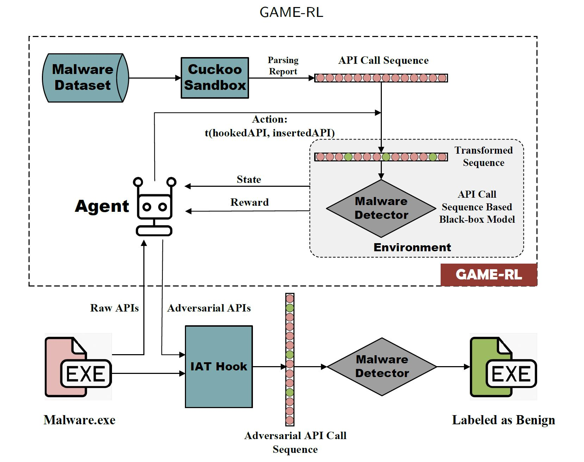
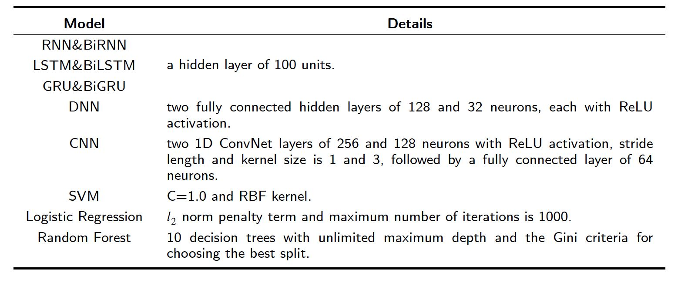
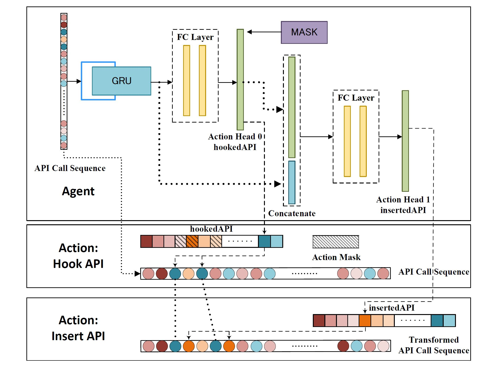
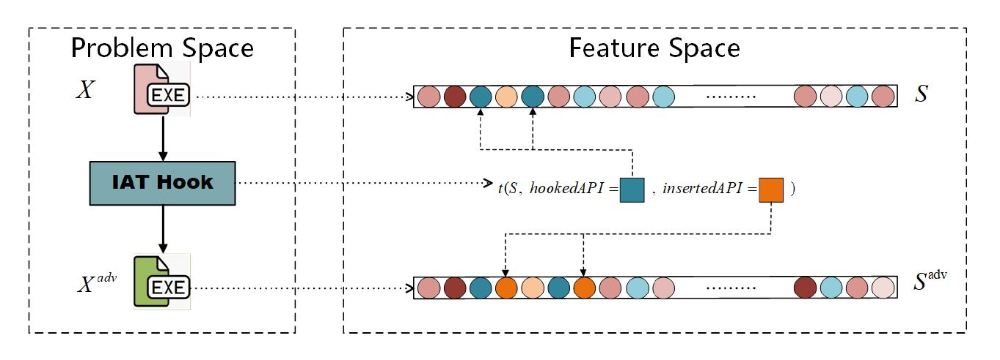
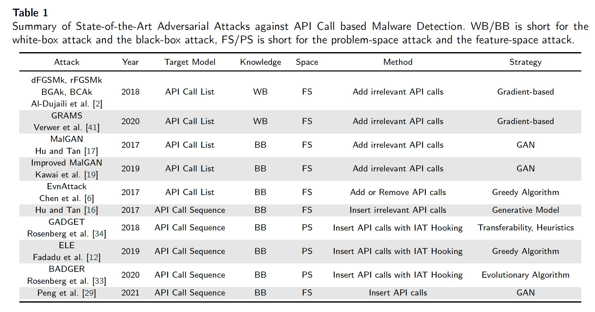

# GAME-RL
> Generating Adversarial Malware Examples Against API Call Based Detection via Reinforcement Learning

## Environment
GAME-RL exposes OpenAI's `gym` environments to allow researchers to develop Reinforcement Learning agents to bypass API call sequence based malware detectors. 

Application Programming Interface (API) call is a set of definitions, protocols, and programs that enable interactions between software components.
The model input is an API call sequence with length `𝐿 = 200` and dimension `𝐸 = 8`. The [Cuckoo sandbox](https://github.com/cuckoosandbox/cuckoo/wiki/Hooked-APIs-and-Categories) tracked a total of 312 API calls belonging to 17 categories.
The target models consist of eight deep learning models (RNN, BiRNN, LSTM, BiLSTM, GRU, BiGRU, DNN, CNN) and three machine learning models (Support Vector Machine (SVM), Logistic Regression (LR), Random Forest (RF)). The detailed structure of the model as follows:

### Action Space
We define the selection of `hookedAPI` and `insertedAPI` in the IAT hooking operation as actions of the RL agent. 
We implement the no operation (no-op) attack, inserting API calls with valid (non-empty) but meaningless parameters, which can ensure the API calls run smoothly and return values indicating successful execution.

### Observation Space
The `observation_space` of the `gym` environments are a feature vector representing the malware sample. In this work，we use the extracted API call sequence as the state space the sequence call.

### Agents
To ensure the validity of IAT hooking operations based on the learned policy, we incorporate an invalid action masking mechanism to avoid invalid choices. Additionally, we employ the auto-regressive policy head to ensure that the RL agent considers the coupling relationships between different actions during the policy learning process.

## IATHOOK

## Baselines

